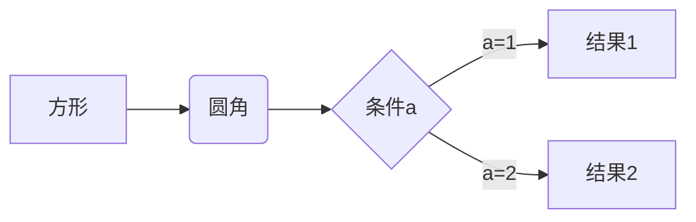
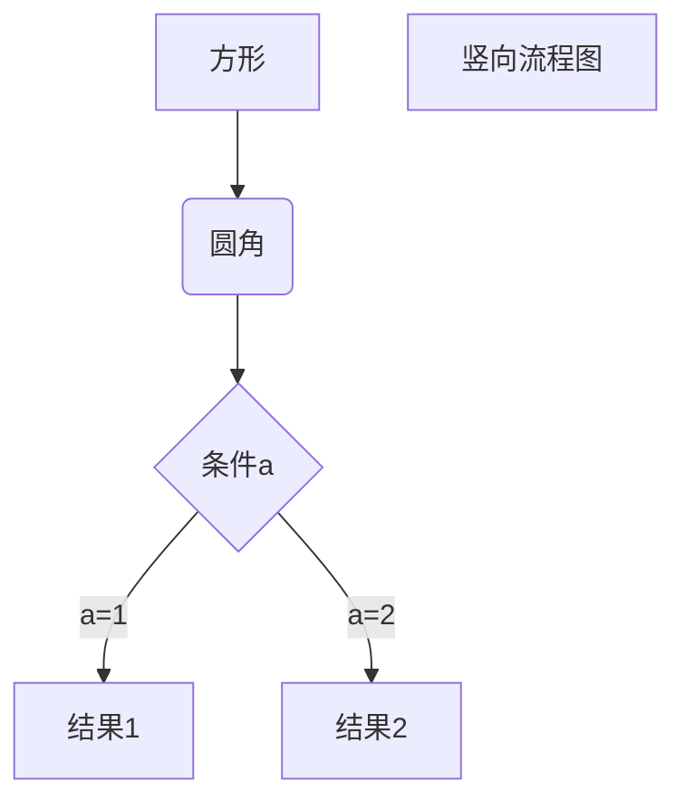

markdown
#Test
##标题就是
我展示的是一级标题
=

我展示的是二级标题
-
***


#一级标题
##二级标题
###三级标题
####四级标题
---


*斜体文本*
_斜体文本_
**粗体文本**
***斜体加粗体文本***
__斜体加粗体文本__

___
~~删除文字的效果~~
<u>带下划线的文字</u>

创建脚注格式类似这样[^RUNOOB] :学的不仅是技术，更是梦想！！！

+ 第一项
+ 第二项
+ 第三项
- 第一项

1. 第一点 
    - 地点
2. 第二点
   - 等等
   - 第二个

1. 第一项
    - 第一项嵌套的第一个元素
    - 第一项嵌套的第二个元素
2. 第二项
    - 第二项嵌套的第一个元素
    - 第二项嵌套的第二个元素

***
##区块的使用
> 一级区块
>>二级区块
>>三级区块

>下面的内容属于这一区块
>1. 第一个内容主要讲述区块
>   - 子内容
>   - 作为承接的第二点
>2. 第二个是实现区块的使用
>+ 这个小黑点的方式
>+ 记录分点更加清晰
>* 也可使使用*号

`printf()` 函数

```javascript
$(document).ready(function () {
    alert('RUNOOB');
});
```

```c++
 #include<iostream>
 using namespace std;
 int main()
 {
     int n,sum=0;
     cin>>n;
     for(int i=0;i<n;i++)
     {
         sum+=i;
     }
     cout<<"输出的内容是”<<sum<<endl;
     return 0;
 }
````
***
##代码区分块
    <?phposfsdfsdfsdfsd
    sdfsdfsdfsd
    sdfsd
    fsd
    fsd
    f
    sdf
    dsf>

这是一个链接地址[百度][test]
这是一个链接地址<https://www.badi.com>
这个链接用 1 作为网址变量 [Google][1]
这个链接用 runoob 作为网址变量 [Runoob][runoob]
然后在文档的结尾为变量赋值（网址）

[1]: http://www.google.com/
[runoob]: http://www.runoob.com/
[test]: https://www.baidu.com


|姓名|年龄|地址|
|:----:|:----:|:----:|
|樊江涛|21|宜宾|
|樊江涛|22|成都|

| 左对齐 | 右对齐 | 居中对齐 |
| :-----| ----: | :----: |
| 单元格 | 单元格 | 单元格 |
| 单元格 | 单元格 | 单元格 |
***
使用 <kbd>音量</kbd>+<kbd>电源</kbd>+<kbd>删除</kbd> 重启电脑
***
###公式表达
$$
\begin{Bmatrix}
   a & b \\
   c & d
\end{Bmatrix}
$$
$$
\begin{CD}
   A @>a>> B \\
@VbVV @AAcA \\
   C @= D
\end{CD}
$$


***

***
```flow
st=>start: 开始框
op=>operation: 处理框
cond=>condition: 判断框(是或否?)
sub1=>subroutine: 子流程
io=>inputoutput: 输入输出框
e=>end: 结束框
st->op->cond
cond(yes)->io->e
cond(no)->sub1(right)->op
```
***
```flow
st=>start: 开始框
op=>operation: 处理框
cond=>condition: 判断框(是或否?)
sub1=>subroutine: 子流程
io=>inputoutput: 输入输出框
e=>end: 结束框
st->op->cond
cond(yes)->io->e
cond(no)->sub1(right)->op
```

:smile: